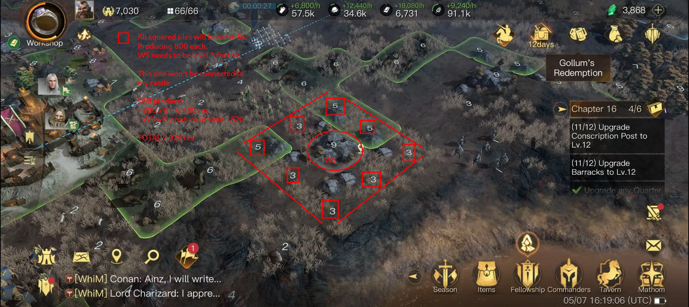
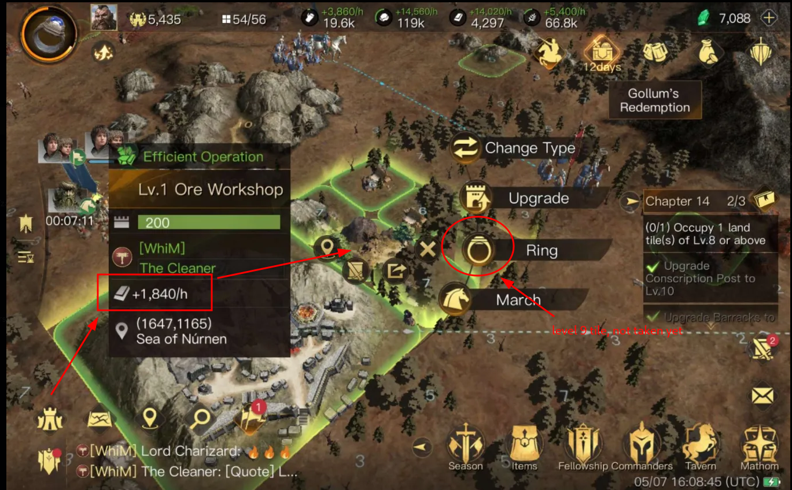
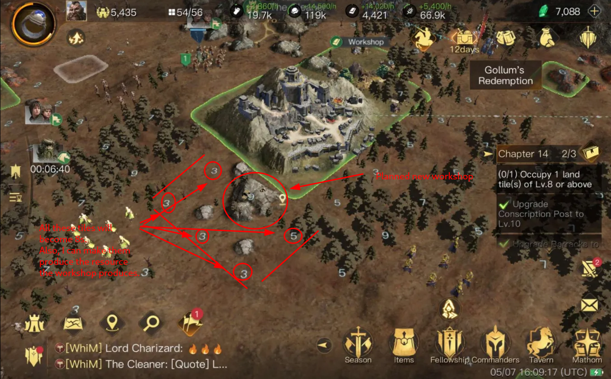
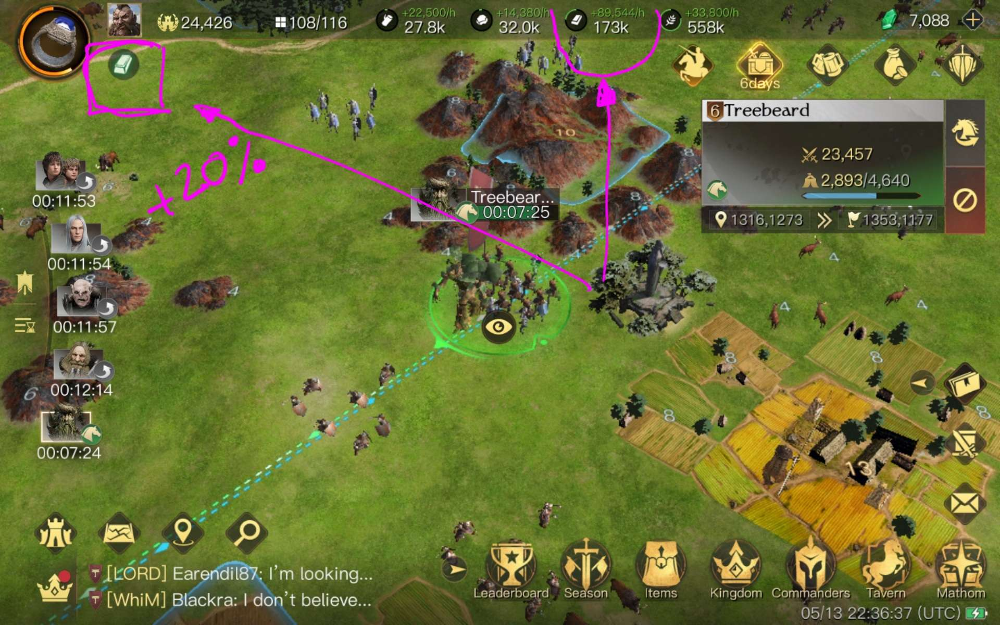
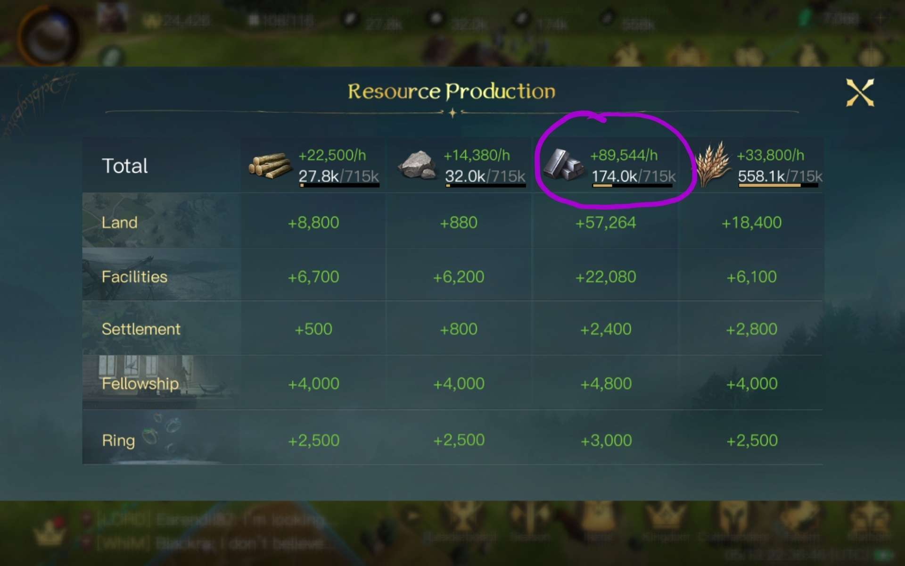

# Workshop Guide

## TL;DR

Worshops, WS from now on, are cool :) Use them!

With WS you can convert those 2 to 7 level tiles nobody wants into 8s.

**You can build up to six WS, that's roughly 8k x 6 = 48k resources / hour (1,152k daily) that you can quickly switch type if in need.**

## Standard Plan

Image shows what I call the **standard plan** for workshops, which produces almost 8k resources per hour.

- you want it on the highest possible tile level, that's 9, cannot build on 10s and beyond.
- you want it fully surrounded by above level 1 tiles (level 1 tiles cannot be transformed into 8s), but preferably not above 8. So from 2 to 7 is ok, also an occassional 8 or 9 is ok. But if it's fully or mostly surrounded by big tiles, is not worth it.
- you don't care about connecting it to your castle cause your castle is going to move at some point, provided you are not a farmer.
- can be on a lumber tile, but stone is the thing everybody drops when the game advances and probably the most easy to find and keep.

This set up provides you with the maximum possible amount of resource income without connection to castle.

**PROs:**
- if resources are scarce, you can transform lower level tiles that nobody wants into 8s.
- if you properly _Reclaim_ all surrounding tiles, then you can change the workshop resource and **all the tiles change** at once with a single click, so you become able to pivot resources income according to your most urgent needs.

Having said that, I recommend this: build the WS for a resource that's none of the surrounding ones, then you can _Reclaim_ all surrounding tiles, and once that's done, you can switch the WS to whatever you want, and all tiles will switch to produce that too. It takes 30 minutes.

Regarding the last recommendation: if you don't choose a different resource or can't because there's the four types surrounding, then take care to _Reclaim_ everything you can, then switch to a different resource and finish _Reclaiming_ the missing ones, so you can then swiftly switch production type for all the cluster whenever you need it.

## Connected without path

This image shows a temporal WS built on a level 7 tile. As you can see, the WS is producing 1,840 res / hour, but it will be more once the WS gets upgraded (this image was taken early during a season and I still haven't build the MH 7, which was required for the last upgrade on WS) and the tiles get upgraded to 8. The two 6s were 3s. Also when the 9 got finally taken, the WS produced a little bit more.

This WS works in _Efficient Operation_ mode, which means it produces more. A non-connected WS would produce less resources.

If you have a good spot for a WS near your castle, but is not stuck to it, you can get _Efficient Operation_ by building a _path_ between your castle and the WS.

**BUT PRETTY PLEASE** don't waste precious tile-space connecting with a 10-tile long path. That's a waste. Think that each path-tile can be a 10 or bigger. Use at most 1 or 2 tile paths, and only if the WS you are connecting is fully surrounded with upgradeable tiles.

So my recommendation is: either build the WS right next to your castle, or no more than one tile away. Anything further and you should forget about connecting it and go for the _standard plan_ already explained.

## A planned Workshop

This hows a planned spot for when I'm able to take a 9, cannot do now. The output of the WS is tied to the level of the tile you build it on and the tiles that surround it.

That's why the standard plan recommends a fully surrounded 9 tile.

## Bonus Tip

If you have low level armies that need training, when upgrading the surrounding tiles, instead of going directly for the 8, go level by level. It's a cheap way to find low level mobs when they start to get scarce in the map.

Finally, some people will tell you "WS are crap", and that requires an explanation: If you are a whale/kraken running in a server-dominant alliance, you probably are filled with 10s and above tiles and of course, in that situation, workshops are just extra work for no benefit. For the rest of the mortals, workshops are a cool addition to the game.

## Power Ups

Another tip on farming with workshops: buy the resource power ups from the alliance store but don't use them right away. Save them. Then switch all your WS to a single resource, maybe before going to bed, and apply the proper power up. You'll get huge income.

As you can see, these are early server screenshots, maybe day 2 or 3, and the difference on the other resources is huge.

## DO NOT DO THIS

**ToDo** add an image of one of those morons we usually find on the map with cities full of paths to far away WS.

## Battle Zone Notes

When you get to the battle zone: **DO NOT BUILD WS TO DELAY THE ENEMY**

If you build a WS, it augments the needed siege power, yes, but you eliminate the defenders and the needed siege is not big anyway. So the rival will just take the tile without a fight.

On the other hand, if the tile is without buildings, the rival will need to fight the defenders, and depending on the tile level that could be costly.

**But**, WS expand your visibility. So in the end maybe you want to build one to see armies coming from afar. I prefer not to.

